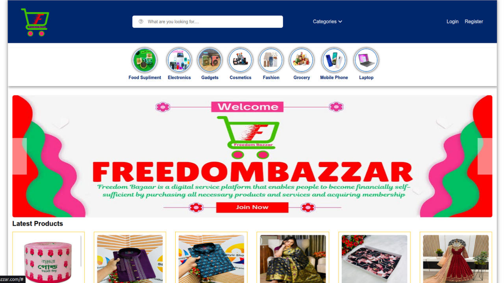
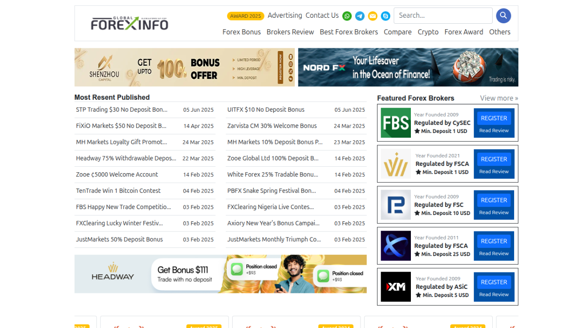
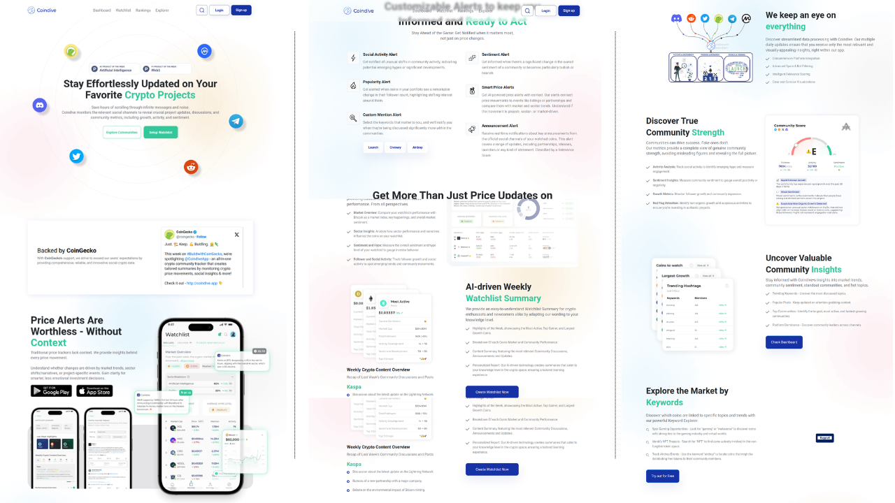
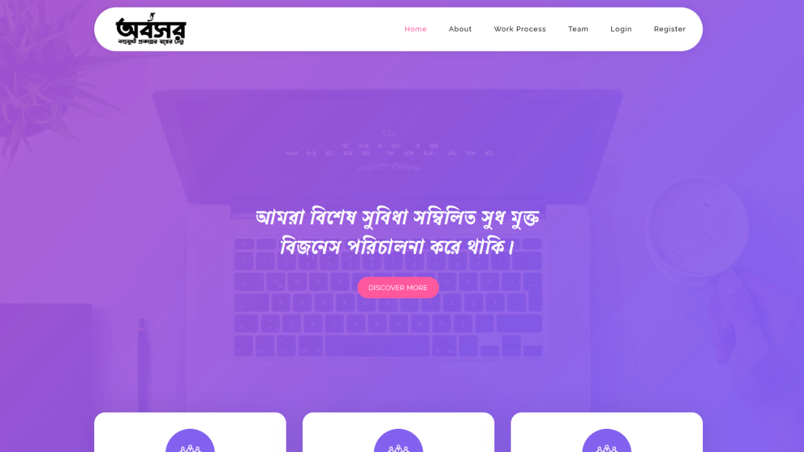
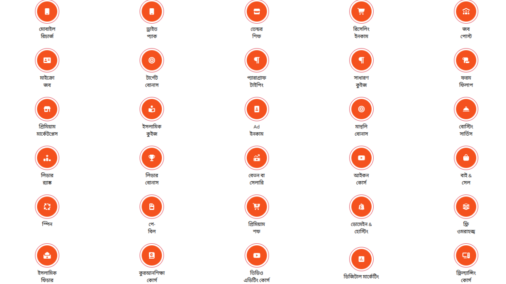

<!-- ================= HERO SECTION ================= -->

<!-- ================= ABOUT SECTION ================= -->
# About Me

<table>
<tr>
<td width="25%" align="center">

</td>

<td width="75%">

My primary goal is to apply my technical expertise all throughout the full software life cycle to ensure the production and delivery of products and services that meet client specifications. One of my objectives is to keep updated with the latest IT trends and technologies. I am confident that if I am given the opportunity, I can be a useful talent for the company.

<b>✔ 4+ Years Experience</b> 
<b>✔ 200+ Clients Worldwide</b>

</td>
</tr>
</table>

<!-- ================= SERVICES SECTION ================= -->
# Services

<table>
<tr>
<td width="25%">

### 01 Web Design  
I create responsive, user-friendly websites with clean design and fast, SEO-optimized performance.

</td>

<td width="25%">

### 02 Web Development  
I build fast, responsive, and modern websites using the latest web technologies and best practices.

</td>

<td width="25%">

### 03 Web Research  
I provide accurate and in-depth web research to gather insights, data, and trends for any project.

</td>

<td width="25%">

### 04 SEO Optimization  
I optimize websites for search engines to boost visibility, rank higher, and drive organic traffic.

</td>
</tr>
</table>

<!-- ================= PORTFOLIO SECTION ================= -->
# Portfolio

<table>
<tr>

<td width="33%" align="center">

  
<b>Freedom Bazzar</b>
<a href="https://freedombazzar.com" target="_blank"> ➜</a>
</td>

<td width="33%" align="center">

  
<b>Global Forex Info</b>
<a href="https://globalforexinfo.com" target="_blank"> ➜</a>
</td>

<td width="33%" align="center">

  
<b>CoinDive App</b>
<a href="https://coindive.app" target="_blank"> ➜</a>
</td>

</tr>

<tr>

<td width="33%" align="center">

  
<b>Abosor</b>
<a href="https://abosor.com" target="_blank"> ➜</a>
</td>

<td width="33%" align="center">

  
<b>Icon Inspire Tech</b>
<a href="https://iconinspiretech.pro" target="_blank"> ➜</a>
</td>

<td width="33%" align="center">

  
<b>More Projects</b>
</td>

</tr>
</table>

<!-- ================= EXPERIENCE SECTION ================= -->
# Experience

<table>
<tr>
<td width="25%">

**2019 – 2020**  
Web Design & Development  
Creative IT Institute

</td>

<td width="25%">

**2020 – 2021**  
Junior Web Developer  
Sowdagri

</td>

<td width="25%">

**2022 – 2024**  
Full Stack Web Developer  
VCA

</td>

<td width="25%">

**2024 – Current**  
Full Stack Web Developer  
Self Employed

</td>
</tr>
</table>

<!-- ================= SKILLS SECTION ================= -->
# Skills

<table>
<tr>
<td align="center" width="16%">
 
<b>82%</b> Figma
</td>

<td align="center" width="16%">
 
<b>95%</b> HTML/CSS
</td>

<td align="center" width="16%">
 
<b>85%</b> Bootstrap
</td>

<td align="center" width="16%">
 
<b>70%</b> React
</td>

<td align="center" width="16%">
 
<b>90%</b> PHP/Laravel
</td>

<td align="center" width="16%">
 
<b>80%</b> API's
</td>
</tr>
</table>

<!-- ================= FOOTER SECTION ================= -->

### Connect With Me

  

© **Copyright MD. AL-AMIN**

